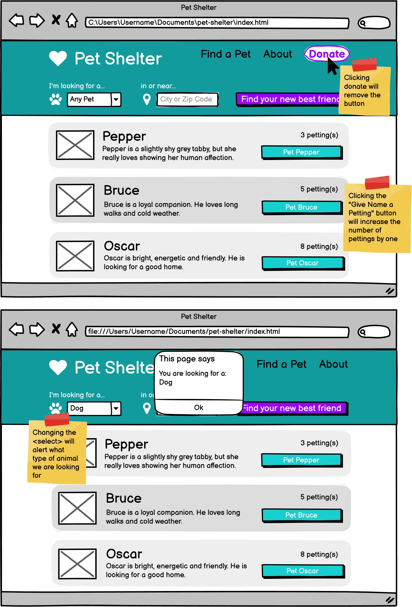

# Pet Shelter Web Page
## Coding Dojo Belt Exam for Web Fundamentals - 1st Stack
- *Completed with HTML, CSS and Javascript in ~3 hours*
- *Pages link to site: https://sasszz.github.io/petShelter/*

### Highlighted Functionality:
- Buttons and Navigation Bar Links change color when hovered over
- Donate button disappears when clicked
- Drop down menu for pet selection triggers an alert
- Clicking "Pet" button increases number of pets
- Heart-shaped frame over pet images

### Screen Capture of Web Page:

  

### Template provided by Coding Dojo for Exam:

  

